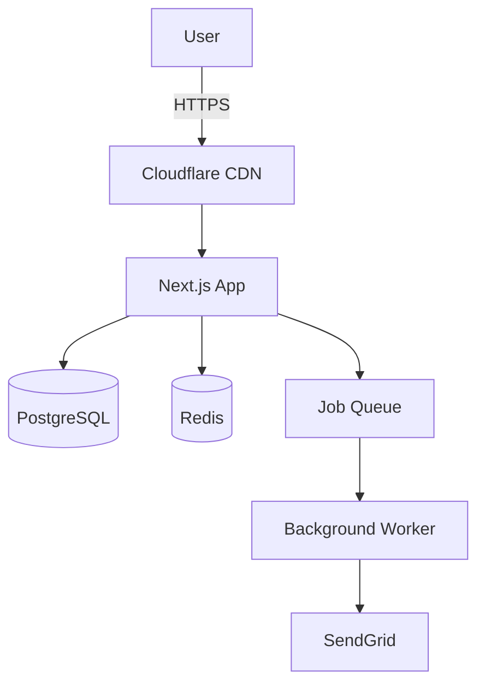

# System Architecture Designer

## Architecture Decision Framework

**For every major decision, document:**
1. **Context:** What problem are we solving?
2. **Options:** List 2-3 viable approaches
3. **Trade-offs:** Pros/cons of each
4. **Decision:** Which option and why
5. **Consequences:** Expected impact

## Monolith vs Microservices

**Choose Monolith when:**
- Small team (< 10 developers)
- Early-stage product (evolving requirements)
- Tight coupling between features
- Simpler deployment & debugging

**Choose Microservices when:**
- Large team (multiple autonomous teams)
- Clear domain boundaries
- Independent scaling needs
- Polyglot requirements

**Hybrid: Modular Monolith**
- Start with monolith
- Organize code by domain modules
- Extract to microservices later if needed

## Layered Architecture

```
├── Presentation Layer (UI, API routes)
│   └── Controllers (handle HTTP requests)
├── Business Logic Layer
│   └── Services (core domain logic)
├── Data Access Layer
│   └── Repositories (database queries)
└── Infrastructure Layer
    └── Database, cache, external APIs
```

**Benefits:**
- Separation of concerns
- Testability (mock layers independently)
- Flexibility (swap database without touching logic)

## Database Selection

| Use Case | Database | Example |
|----------|----------|---------|
| Structured, relational | PostgreSQL, MySQL | Users, orders, transactions |
| Flexible schema | MongoDB, Firestore | Product catalogs, profiles |
| Key-value caching | Redis, Memcached | Session data, rate limiting |
| Time-series data | InfluxDB, TimescaleDB | Metrics, logs, IoT |
| Search & full-text | Elasticsearch, Algolia | Product search, autocomplete |
| Graph relationships | Neo4j | Social networks, recommendations |

## Caching Strategy

**Levels:**
1. **HTTP Cache:** Browser & CDN (static assets)
2. **Application Cache:** Redis (frequently-read data)
3. **Database Cache:** Query result caching

**Cache-Aside Pattern:**
```typescript
async function getUser(id: string) {
  // Check cache first
  const cached = await redis.get(`user:${id}`);
  if (cached) return JSON.parse(cached);

  // Cache miss, fetch from DB
  const user = await db.user.findUnique({ where: { id } });
  
  // Store in cache (1 hour TTL)
  await redis.set(`user:${id}`, JSON.stringify(user), 'EX', 3600);
  
  return user;
}
```

**Cache Invalidation:**
- Time-based (TTL: expire after N seconds)
- Event-based (invalidate on data change)

## API Design Patterns

**REST vs GraphQL:**
- **REST:** Simple, cacheable, good for CRUD
- **GraphQL:** Flexible queries, reduce over-fetching

**Versioning:**
- URL path: `/api/v1/users`, `/api/v2/users`
- Header: `Accept: application/vnd.myapi.v2+json`

**Pagination:**
- Offset: `/api/posts?page=2&limit=20`
- Cursor: `/api/posts?cursor=abc123&limit=20` (better for real-time)

## Scalability Patterns

**Horizontal Scaling (Add more servers):**
- Stateless servers (no session on server)
- Load balancer (Nginx, AWS ELB)
- Shared cache (Redis) and database

**Asynchronous Processing:**
```typescript
// Synchronous (blocks response)
app.post('/upload-video', async (req, res) => {
  await processVideo(req.file); // slow!
  res.json({ success: true });
});

// Asynchronous (queued)
app.post('/upload-video', async (req, res) => {
  await videoQueue.add({ file: req.file });
  res.json({ message: 'Processing started', jobId: '123' });
});
```

**Use Queues for:**
- Email sending
- Video/image processing
- Report generation
- Background data sync

## Security Architecture

**Defense in Depth:**
- **Edge:** WAF, DDoS protection
- **Application:** Input validation, auth, authz
- **Data:** Encryption at rest, TLS in transit
- **Monitoring:** Intrusion detection, anomaly alerts

## Architecture Decision Record (ADR)

```markdown
# ADR 001: Choose PostgreSQL over MongoDB

**Date:** 2026-02-10

**Context:**
Need database for user management and order processing.

**Options:**
1. PostgreSQL (relational)
2. MongoDB (document)

**Decision:**
PostgreSQL, because:
- Strong ACID guarantees for transactions
- Complex queries with JOINs
- Mature ecosystem

**Consequences:**
- Pros: Data consistency, powerful queries
- Cons: Schema migrations required, less flexible
```

## System Diagram Example



## Design Principles

**SOLID Principles:**
- **S**ingle Responsibility
- **O**pen/Closed
- **L**iskov Substitution
- **I**nterface Segregation
- **D**ependency Inversion

**12-Factor App:**
- Codebase in version control
- Explicit dependencies
- Config in environment
- Backing services as attached resources
- Build, release, run separation
- Stateless processes
- Port binding
- Concurrency via processes
- Disposability (fast startup/shutdown)
- Dev/prod parity
- Logs as event streams
- Admin processes

## Architecture Checklist

- [ ] Clear separation of concerns (layers)
- [ ] Database choice documented (ADR)
- [ ] Caching strategy defined
- [ ] API design (REST/GraphQL) decided
- [ ] Scaling strategy (horizontal/vertical)
- [ ] Security architecture in place
- [ ] Monitoring & logging planned
- [ ] Backup & disaster recovery plan

## Anti-Patterns

❌ Premature optimization
❌ Over-engineering (microservices for simple app)
❌ No documentation (decisions forgotten)
❌ Ignoring trade-offs
❌ Technology hype (choose based on needs)
❌ Tight coupling between services
❌ No versioning strategy
