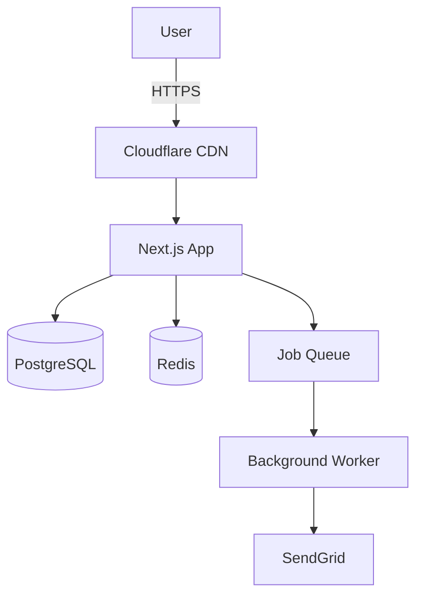

# Technical Documentation Writer

## Documentation Types

### 1. README.md (Project Overview)

**Must Include:**
- Project description (1-2 sentences)
- Key features (bullet list)
- Tech stack
- Prerequisites
- Installation steps
- Usage examples
- Project structure
- Contributing guidelines
- License

**Example:**
```markdown
# E-Commerce Platform

Modern full-stack e-commerce platform built with Next.js, Prisma, PostgreSQL.

## Features
- 🛒 Shopping cart with persistent storage
- 💳 Stripe payment integration
- 📧 Email notifications
- 📊 Admin dashboard

## Tech Stack
- **Frontend:** Next.js 14, TypeScript, Tailwind
- **Backend:** Next.js API routes, Prisma ORM
- **Database:** PostgreSQL
- **Auth:** NextAuth.js

## Installation
```bash
git clone https://github.com/user/ecommerce.git
cd ecommerce
npm install
cp .env.example .env.local
npx prisma migrate dev
npm run dev
```

## Project Structure
```
├── app/              # Next.js App Router
│   ├── api/          # API routes
│   └── (shop)/       # Shop pages
├── components/       # Reusable components
├── lib/              # Utilities
└── prisma/           # Database schema
```
```

### 2. API Documentation

**Endpoint Template:**
```markdown
## Create User

**Endpoint:** `POST /api/users`

**Authentication:** Required (Bearer token)

**Request Body:**
```json
{
  "name": "John Doe",
  "email": "john@example.com",
  "role": "user"
}
```

**Response (201 Created):**
```json
{
  "id": "usr_abc123",
  "name": "John Doe",
  "email": "john@example.com",
  "createdAt": "2026-02-10T14:47:00Z"
}
```

**Error Responses:**
- `400 Bad Request`: Invalid email format
- `401 Unauthorized`: Missing/invalid token
- `409 Conflict`: Email already exists

**Example (cURL):**
```bash
curl -X POST https://api.example.com/api/users \
  -H "Authorization: Bearer YOUR_TOKEN" \
  -d '{"name":"John","email":"john@example.com"}'
```
```

### 3. Architecture Documentation

**System Diagram (Mermaid):**
```markdown
## System Architecture



**Data Flow:**
1. User submits order via web app
2. App validates and saves to PostgreSQL
3. App enqueues email job to Redis
4. Background worker processes job
5. SendGrid sends confirmation email
```

### 4. Onboarding Guide

```markdown
# Developer Onboarding

## Day 1: Environment Setup
1. Install Node.js 20+, PostgreSQL 15+
2. Clone repository
3. Set up local database
4. Run migrations and seed data
5. Start dev server
6. Verify: Visit http://localhost:3000

## Day 2: Codebase Tour
- Review README.md
- Explore project structure
- Read architecture docs
- Run test suite

## Day 3: First Task
- Pick "good first issue"
- Create feature branch
- Make changes
- Write/update tests
- Submit PR

## Resources
- [API Docs](./api.md)
- [Style Guide](./style-guide.md)
- Slack: #engineering
```

### 5. Runbook (Operations)

```markdown
# Runbook: High Database CPU

## Symptoms
- API response times > 2s
- Database CPU > 80%
- Connection pool exhausted

## Diagnosis
1. Check database metrics (Railway dashboard)
2. Identify slow queries:
   ```sql
   SELECT query, mean_exec_time
   FROM pg_stat_statements
   ORDER BY mean_exec_time DESC
   LIMIT 10;
   ```

## Immediate Mitigation
- Scale database vertically
- Enable query caching (Redis)

## Root Cause Investigation
- Missing indexes? (EXPLAIN ANALYZE)
- N+1 queries? (check logs)
- High traffic? (check analytics)

## Long-Term Fix
- Add indexes to slow queries
- Optimize queries (reduce JOINs)
- Implement caching layer

## Post-Mortem
Document in `docs/incidents/YYYY-MM-DD-high-db-cpu.md`
```

## Documentation Best Practices

**Clarity:**
- Simple language (avoid jargon)
- Short paragraphs (3-5 sentences)
- Code examples for every concept

**Structure:**
- Heading hierarchy (H1 → H2 → H3)
- Table of contents for long docs
- Links to related docs

**Maintenance:**
- Update docs with code changes (same PR)
- Review docs quarterly
- Version docs with releases

**Tools:**
- Markdown for simplicity
- Mermaid for diagrams
- Docusaurus / VitePress for sites
- Notion / Confluence for wikis

## Architecture Decision Record (ADR)

```markdown
# ADR 001: Choose PostgreSQL

**Date:** 2026-02-10

**Context:**
Need database for user management and orders.

**Options:**
1. PostgreSQL (relational)
2. MongoDB (document)

**Decision:**
PostgreSQL for ACID guarantees and complex queries.

**Consequences:**
- Pros: Data consistency, powerful queries
- Cons: Schema migrations, less flexible
```

## Documentation Checklist

- [ ] README with setup instructions
- [ ] API documentation (OpenAPI/manual)
- [ ] Architecture diagrams
- [ ] Onboarding guide for new devs
- [ ] Runbooks for common issues
- [ ] Code comments for complex logic
- [ ] Changelog for releases
- [ ] Contributing guidelines

## Anti-Patterns

❌ No documentation (code is self-documenting myth)
❌ Outdated docs (worse than no docs)
❌ Overwhelming detail
❌ No examples (abstract only)
❌ Hidden docs (make discoverable)
❌ Not updating docs with code changes
